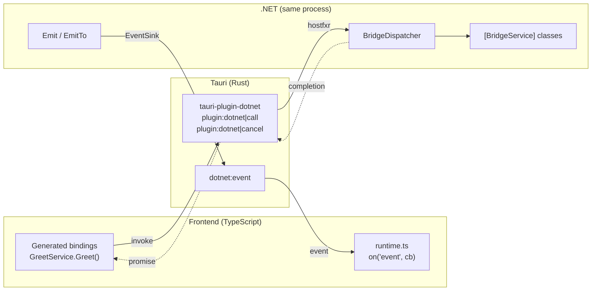

# tauri-plugin-dotnet


Write your Tauri app's backend in .NET. Mark C# classes with `[BridgeService]`, run `dotnet build`, and call them from TypeScript through generated, fully typed bindings, with your frontend still running inside Tauri and using its plugins, bundler and updater.

> This is a community plugin. It is not officially approved by or affiliated with Tauri.

## Requirements

**On the machine that runs the app**

- A **.NET 8 or newer runtime**, installed system-wide or in a `dotnet` folder next to the executable. The backend is framework-dependent and the plugin hosts the runtime inside the Tauri process. The default roll-forward policy is `Minor`, so a backend built for net8.0 needs an 8.x runtime unless you set `RollForward`.
- WebView2 on Windows (as for any Tauri app).

**On the development machine**

- Rust 1.95 or newer, needed by the `netcorehost` dependency (held at 0.22).
- The .NET SDK (8 or newer).
- Node.

## Getting started

This is the whole setup, checked by following it in a new `npm create tauri-app` project (React \+ TypeScript template; the app is called `myapp`).

**1. Add the Rust plugin.** In `src-tauri`, run `cargo add tauri-plugin-dotnet`. Then add one line to the builder in `src-tauri/src/lib.rs` (use the name of your own backend project instead of `MyApp.Backend`; you create it in step 2). Whatever the builder already has stays: a new Tauri project starts with `.plugin(tauri_plugin_opener::init())` and a `greet` command registered with `.invoke_handler(...)`.

```rust
tauri::Builder::default()
    .plugin(tauri_plugin_dotnet::backend!("MyApp.Backend"))
    // ...your existing .plugin(...) and .invoke_handler(...) calls stay here...
    .run(tauri::generate_context!())
    .expect("error while running tauri application");
```

`backend!` finds the built backend: the project's own Debug build output in `tauri dev`, or `resource_dir()/dotnet/` (shipped by `bundle.resources`) in an installed app. In a debug build it runs the backend as a separate dev-only process, the **sidecar** mode (see [Development: the dev-only sidecar host](#development-the-dev-only-sidecar-host)), so a rebuild never blocks on the app and never restarts it; a release build loads it inside the app itself, the **path** mode, as described in [Hosting](#hosting-net-runs-inside-the-tauri-process) (there is also an opt-in **embedded** mode, covered there too). It assumes the layout the rest of this guide sets up: a project at `../src-dotnet/MyApp.Backend/`, next to `src-tauri`, targeting net8.0, whose assembly has the same name as its folder. Two keys cover the common differences, in either order: `backend!("MyApp.Backend", assembly = "MyApp", tfm = "net9.0")`. If the build output is somewhere else (a `RuntimeIdentifier`, artifacts output or a custom `OutputPath`), build the host yourself with `tauri_plugin_dotnet::init_with(|_app| HostfxrHost::new(HostfxrOptions::new(<path to your dll>)))`.

Grant the permission by adding `"dotnet:default"` to the `permissions` array in `src-tauri/capabilities/default.json` (with a comma after the entry before it).

**2. Create the backend.** A class library next to `src` and `src-tauri`, targeting net8.0 (`-f net8.0`, because a newer SDK defaults to its own version):

```shell
dotnet new classlib -n MyApp.Backend -f net8.0 -o src-dotnet/MyApp.Backend
cd src-dotnet/MyApp.Backend
rm Class1.cs
dotnet add package Tauri.Plugin.DotNet
```

Add exactly one `IBridgeBackend` and a service (the package's `.props` sets what loading needs, so the csproj stays as it is):

```csharp
using Tauri.Plugin.DotNet;

namespace MyApp.Backend;

public sealed class Backend : IBridgeBackend
{
    public void Configure(BridgeDispatcher dispatcher) => dispatcher.RegisterService(new GreetService());
}

[BridgeService]
public class GreetService
{
    public string Greet(string name) => $"Hello, {name}! Greetings from .NET.";
}
```

**3. Build the backend from Tauri's hooks.** In `src-tauri/tauri.conf.json`, build it before the frontend. `tauri dev` uses a Debug build in the project's own `bin` folder; `tauri build` makes a Release build into `src-tauri/backend` and ships that folder:

```json
{
  "build": {
    "beforeDevCommand": "dotnet build src-dotnet/MyApp.Backend && npm run dev",
    "beforeBuildCommand": "dotnet build src-dotnet/MyApp.Backend -c Release -o src-tauri/backend && npm run build"
  },
  "bundle": {
    "resources": { "backend/": "dotnet/" }
  }
}
```

Add `/backend/` to `src-tauri/.gitignore`: that is where the Release build goes. Tauri also requires that folder to exist whenever the app is compiled, `tauri dev` included, although `tauri dev` never writes there. You do not have to create it: the first Debug build (which `beforeDevCommand` runs before cargo) creates it, empty, when `src-tauri` is next to `src-dotnet` (`TauriDotNetResourceFolder` changes the path, `TauriDotNetSkipResourceFolder` turns it off).

The same `dotnet build` copies `runtime.ts` and generates the TypeScript bindings into `src/bindings` (a fresh clone needs one `dotnet build` before `npm run build` or `cargo`, which the hooks do for you; commit the bindings or ignore them, as you prefer).

**4. Call it from the frontend.**

```ts
import { GreetService } from "./bindings";

const message = await GreetService.Greet("World"); // "Hello, World! Greetings from .NET."
```

**5. Run and package.** `npm run tauri dev` runs the app; `npm run tauri build` makes the installer (see [Shipping your app](#shipping-your-app)).

**Changing C# while `tauri dev` runs.** Just save. The plugin runs the backend under `dotnet watch` itself (see [Development: the dev-only sidecar host](#development-the-dev-only-sidecar-host)), so a saved edit is picked up automatically - no manual rebuild step, no second terminal.

- **Why it works.** In a debug build, `backend!` runs the backend as a separate process under `dotnet watch`, not inside the app. A method-body-only edit is applied in place with no restart at all (`dotnet watch`'s own Hot Reload); anything else (a new or changed method, a new type) restarts just that process once it compiles. The app's window, its Rust process and the frontend are never touched either way.
- **What you see.** The window stays open and responsive; nothing reloads. A call made while the backend is disconnected - mid-restart, or after a real crash, deliberately not distinguished - fails immediately with `HostSidecarUnavailable`; retrying once the backend has reconnected works normally. The Rust side is not recompiled or restarted (unless you also changed Rust code, which still triggers Tauri's own restart as usual).
- **Errors.** A compile error is reported by `dotnet watch` in its own console output; the previous backend process is left running and answering calls untouched until you fix it and save again.
- **Several edits in a row** are fine: `dotnet watch` debounces its own rebuilds.

## How it fits together


- **Calls are promises.** `invoke("plugin:dotnet|call", { callId, method, args })` resolves with the .NET return value or rejects with `{ message, type }`, which the runtime turns into an `Error` whose `name` is the .NET exception type. The `callId` exists only so a call can be cancelled.
- **Cancellation and timeouts.** `cancellableCall(...).cancel()` and per-call timeouts send `plugin:dotnet|cancel`, which triggers the `CancellationToken` a service method declares.
- **Events.** Mark a payload class `[BridgeEvent("progress")]`, then C# calls `dispatcher.Emit(new ProgressEvent { ... })` (all webviews) or `dispatcher.EmitTo(windowLabel, new ProgressEvent { ... })`. The name comes from the attribute, so it is written once, and the generated TypeScript gets a typed `onProgress(cb)`. (`Emit(name, data)` and `EmitTo(windowLabel, name, data)` remain for ad-hoc events.) The plugin emits them as the `dotnet:event` Tauri event and `runtime.ts` fans them out to `on(name, cb)` subscribers.
- **Call context.** A service method can declare a `CallContext` parameter to learn which webview called it (`WindowLabel`).
- **C# calling the frontend.** When C# needs something only a webview can do, such as showing a Tauri dialog, it awaits a typed call to the frontend. See [Calling the frontend from C#](#calling-the-frontend-from-c).

## Types in the bindings

Arguments, results and event payloads travel as JSON (`System.Text.Json`, camelCase, `null` properties omitted), and the generator types them like this:


|C#|TypeScript|
|:---|:---|
|`string`, `Guid`, `DateTime`, `DateTimeOffset`, `TimeSpan`, `DateOnly`, `TimeOnly`, `Uri`|`string`|
|`bool`|`boolean`|
|`byte`, `short`, `int`, `long`, `float`, `double`, `decimal` and their unsigned forms|`number`|
|`byte[]`|`string` (base64)|
|arrays, `List<T>`, `IEnumerable<T>` and the other list interfaces, `HashSet<T>`, `SortedSet<T>`, `ISet<T>`|`T[]`|
|`Dictionary<K, V>` and its interfaces|`Record<K, V>`|
|`KeyValuePair<K, V>`|`{ key: K; value: V }`|
|tuples, `(int, string)` or `Tuple<int, string>`|`[number, string]`|
|`JsonElement`, `JsonNode` (any JSON)|`unknown`|
|`T?`|`T \| null`|
|enums|a numeric TypeScript `enum`; with `JsonStringEnumConverter`, a string enum (see Converters below)|
|classes and records from your own assemblies|an `interface`; a base class becomes `extends`|
|generic classes such as `Page<T>`|`interface Page<T>`, used as `Page<Person>`|
|anything else (`char`, `Version`, immutable collections, ...)|`unknown`|

**Tuples** are sent as JSON arrays, which is how the bridge differs from plain `System.Text.Json`: it would drop the items of a `(int, string)` and send `{}`. The names of the items in `(int Id, string Name)` are not kept, so use a record when the names matter. A tuple of more than seven items is refused with an error, not sent as `{}`. An `IReadOnlySet<T>` can be returned, but not taken as a parameter, because .NET cannot read one; take a `HashSet<T>` or `ISet<T>` instead.

**Converters.** A `[JsonConverter]` changes the JSON, so the generator follows it where it can. `[JsonConverter(typeof(JsonStringEnumConverter))]` on an enum makes it a string enum (`Low = "Low"`). On a property it types that property as a union of the member names (`"Low" | "High"`), and the same enum stays numeric everywhere else. A `[Flags]` enum written that way is a `string`, because the value is the names joined with `", "` (`"Read, Write"`). Only that parameterless converter is understood. With any other converter, including a subclass that sets a naming policy, the generator cannot know what the JSON looks like, so it types the type or property as `unknown` and prints a build warning (`TAURIDOTNET010`); check or cast the value where you use it. The bridge's own JSON options are fixed, so a converter can only be applied by attribute.

**Method names are unique.** A call names its method, ignoring case, so a service cannot have two methods with the same name: overloads, or `Baz` and `baz`. Registering such a service fails at startup, and the binding generator fails the build (`TAURIDOTNET011`) with the names of the methods involved. Rename them, or hide all but one with `[BridgeIgnore]`.

**Large numbers.** A JavaScript number holds integers exactly only up to 2\^53 - 1 (9007199254740991) and about 15 significant digits, the same limit Tauri's own commands have for `u64` and `i64`. A `long`, `ulong` or `decimal` beyond that reaches the frontend rounded, and the same happens to a number the frontend sends. To keep the digits exact, write the value as a string, with `System.Text.Json`'s own attribute on the property (or on the class, for all its properties):

```csharp
public class Account
{
    [JsonNumberHandling(JsonNumberHandling.WriteAsString | JsonNumberHandling.AllowReadingFromString)]
    public long Id { get; set; }        // id: string in TypeScript
}
```

The bindings then type that property as `string` (or `string[]`, `Record<string, string>` for a collection of numbers), and it can be sent back as a string. Use both flags: with only `WriteAsString`, .NET would refuse the string when it comes back. `AllowReadingFromString` alone changes nothing that is written, so the property stays a `number`. The attribute works on model and event properties only; a method's own parameters and result are always plain numbers, so return a small model, or a `string`, for a big value.

## Calling the frontend from C#

Services let the frontend call C#. To go the other way, declare an interface of what the frontend can do:

```csharp
[BridgeFrontend]
public interface IFrontend
{
    Task<string?> PickFile(string title, CancellationToken cancellationToken);
}
```

`dotnet build` generates a typed TypeScript interface and an `implementFrontend` function. Implement it once at startup, using any Tauri JS API (here the dialog plugin):

```ts
implementFrontend({
  PickFile: async (title) => (await open({ title, multiple: false })) ?? null,
});
```

C# then awaits it from any code, on any thread, with the label of the window to ask (`CallContext.WindowLabel` is the caller's):

```csharp
var path = await dispatcher.GetFrontend<IFrontend>(windowLabel).PickFile("Choose a file", ct);
```

- **Errors:** an exception thrown in the frontend becomes a `FrontendException` whose `ErrorType` is the JavaScript error's name. No answer within two minutes throws a `TimeoutException` (change it with `GetFrontend<T>(label, timeout)`). A `CancellationToken` parameter cancels the wait and is not sent.
- **Nullability:** `string?` and `Task<string?>` become `string | null` in TypeScript, for these interfaces and for services.
- **Rules:** the interface must be public, with methods returning `Task` or `Task<T>`, unique names, and no properties. `GetFrontend` checks this and says what is wrong.
- **Registration:** the window must have called `implementFrontend` before the call; a request that arrives earlier is not replayed. A window that never registers anything does not listen at all, so a call to it ends in the timeout. Only the window that was asked can answer.
- **Upgrading:** the build refreshes `src/bindings/runtime.ts` whenever the package's copy differs, so upgrading the package needs nothing extra and the generated files (`frontends.ts` needs the current runtime) always match it. Do not edit that file.

## Hosting: .NET runs inside the Tauri process

`HostfxrHost` loads the .NET runtime into the app through `hostfxr` and calls `[UnmanagedCallersOnly]` entry points in `Tauri.Plugin.DotNet.Hosting.NativeHost`. Only pointers and lengths cross the boundary; each side copies what it receives, so neither frees the other's memory. Calls return immediately and complete through a callback, so a slow C# method never blocks Tauri's threads.

The backend runs one of three ways. `backend!` picks between the first two automatically, by build profile; embedding is always opt-in. To choose a mode yourself, use `sidecar_backend_host!`, `path_backend_host!` or `embedded_backend_host!` inside `init_with`. `sidecar_backend_host!` also compiles in a release build, but it needs the .NET SDK and the backend's source at run time, so it only works on the machine that built it (elsewhere the app shows the start-error dialog).


|Mode|Process|Loaded from|When|
|:---|:---|:---|:---|
|**Sidecar**|separate `dotnet` process, managed by `dotnet watch`|a generated wrapper project referencing the backend|debug builds (`tauri dev`) — see [Development: the dev-only sidecar host](#development-the-dev-only-sidecar-host)|
|**Path**|inside the Tauri process|a folder next to the app|release builds, by default|
|**Embedded**|inside the Tauri process|bytes baked into the executable|opt-in — see [Optional: embed the backend in the executable](#optional-embed-the-backend-in-the-executable)|

The rest of this section covers path and embedded hosting, since `HostfxrHost` runs both in-process; the sidecar runs its own process and is covered separately below.

**Backend project (C#)**: a class library that references `Tauri.Plugin.DotNet` and has exactly one `IBridgeBackend`:

```xml
<PropertyGroup>
  <TargetFramework>net8.0</TargetFramework>
</PropertyGroup>
<ItemGroup>
  <PackageReference Include="Tauri.Plugin.DotNet" Version="0.1.0" />
</ItemGroup>
```

The package's `.props` file sets `EnableDynamicLoading`, `GenerateRuntimeConfigurationFiles` and `CopyLocalLockFileAssemblies` to `true`, so the runtime config, the dependency list and the dependencies (including `Tauri.Plugin.DotNet.dll`) land next to your assembly, which is what the host loads. They are only defaults: a value your project sets wins, but turning one off breaks loading.

```csharp
public sealed class Backend : IBridgeBackend
{
    public void Configure(BridgeDispatcher dispatcher) =>
        dispatcher.RegisterService(new GreetService());
}
```

**Logging (optional)**: the bridge logs registered services, cancelled calls and exceptions thrown by service methods, but only if the backend supplies a logger factory. Override `LoggerFactory` (it is read before `Configure`, so your services can share it):

```csharp
public ILoggerFactory? LoggerFactory { get; } =
    Microsoft.Extensions.Logging.LoggerFactory.Create(b => b.AddConsole().SetMinimumLevel(LogLevel.Debug));
```

The default is no logging. A console logger only shows up when the app was started from a console (Windows release builds have none); for a file, see [Debugging and logs](#debugging-and-logs).

**Tauri app (Rust)**: register the plugin with a host pointing at the built backend. `backend!` does this for the layout in [Getting started](#getting-started); otherwise `init_with` builds the host when the plugin starts, with the app handle at hand:

```rust
use tauri_plugin_dotnet::{HostfxrHost, HostfxrOptions};

tauri::Builder::default()
    .plugin(tauri_plugin_dotnet::init_with(|_app| {
        HostfxrHost::new(HostfxrOptions::new("path/to/MyApp.Backend.dll"))
    }))
```

A host that needs nothing from the app can also be passed directly: `tauri_plugin_dotnet::Builder::new().host(host).build()`.

and grant `dotnet:default` in a capability.

**When .NET cannot be started**, the error is logged, an error dialog tells the user, and the app ends (exit code 1) before its windows are used, in debug and release builds alike. If the .NET runtime the backend needs is not installed, the dialog names it (for example ".NET Runtime 8.0 (x64)", read from the backend's `runtimeconfig.json`). Any other failure (backend not found, mismatched versions, a backend that throws while starting) is shown with its details. To handle it in the frontend instead, keep the app running:

```rust
use tauri_plugin_dotnet::{HostfxrHost, OnStartError};

    .plugin(tauri_plugin_dotnet::init_with(|app| {
        HostfxrHost::new(tauri_plugin_dotnet::backend_options!(app, "MyApp.Backend").on_start_error(OnStartError::KeepRunning))
    }))
```

Every call then rejects with the reason: an error of type `RuntimeMissing` (whose first line is written for the user) or `HostInitFailed`. A custom `DotNetHost` chooses the same way through `DotNetHost::on_start_error`.

**Finding the runtime**: `hostfxr` is looked up, in order, in `HostfxrOptions::dotnet_root` (if set, with no fallback), `DOTNET_ROOT_<ARCH>`, `DOTNET_ROOT`, a `dotnet` folder next to the executable, the folder of the first `dotnet` on `PATH`, then the platform's default install locations. The newest `hostfxr` found is used.

**Matching versions**: the crate and the NuGet package talk through an interface that changes from one version to the next, so they must be the same major and minor version (`0.3.x` with `0.3.x`); the patch number may differ. Before it starts the backend, the crate asks the package for its version and refuses a mismatch with a `HostInitFailed` error that names both versions and says which of the two to update. A pre-release suffix (`0.3.0-beta.1`) is ignored, and a package too old to report a version is treated as older. For this to hold, a release that changes how the two talk to each other must raise the minor version (while the major version is 0), and a patch release must not.

### Shutting down

When the app exits, .NET is told. Tauri ends the process without shutting the .NET runtime down, so nothing in the backend gets a `ProcessExit` event, a finalizer or a `Dispose` on its own (checked in the sample). The plugin does it on Tauri's exit event (`RunEvent::Exit`):

1. New calls are rejected with an error of type `HostStopped`, and calls in flight are cancelled through their `CancellationToken` and given a second to finish.
2. The services you registered are disposed in the reverse of the order they were registered: `DisposeAsync` when a service implements `IAsyncDisposable`, otherwise `Dispose`. A service that throws is logged and does not stop the others.
3. The backend's own `ShutdownAsync` runs, for whatever the backend created itself and no service owns.

```csharp
public sealed class Backend : IBridgeBackend
{
    private readonly Database _database = new();

    public void Configure(BridgeDispatcher dispatcher) =>
        dispatcher.RegisterService(new NotesService(_database));

    public Task ShutdownAsync(CancellationToken cancellationToken) => _database.CloseAsync(cancellationToken);
}
```

- **It waits a bounded time.** The thread that is ending the app waits for the shutdown for at most `HostfxrOptions::shutdown_timeout`, 5 seconds by default (`Duration::ZERO` skips it), and then the app exits whether or not a `Dispose` is still running. In the sample, a disposal that took 15 seconds made the app exit after 5.06 seconds. Keep disposal short; the token passed to `ShutdownAsync` fires when the host stops waiting.
- **It is best effort.** It runs when the app really exits: the window is closed, or `exit()` or `restart()` is called. A crash, a forced kill or a power loss skips it, so keep data safe on disk as you go and do not rely on it alone. This describes `HostfxrHost`; the dev-only sidecar host runs the same shutdown, over its own connection, when the app exits, but not when `dotnet watch` restarts it on a rebuild - that path is `dotnet watch`'s own, and is not a graceful `ShutdownAsync` (see [Development: the dev-only sidecar host](#development-the-dev-only-sidecar-host)).
- **Tray apps.** An app that vetoes `ExitRequested` to keep running is not exiting, so nothing is stopped.
- **A closed window does not cancel its calls** while the app keeps running: they continue until they finish, and their result is dropped.

### Development: the dev-only sidecar host

In a debug build, `backend!` (or `sidecar_backend_host!`) runs the backend as a separate child process (`SidecarHost`) instead of inside the app, managed by `dotnet watch`, and talks to it over a local socket using the same wire protocol `HostfxrHost` uses. This is what [Changing C# while `tauri dev` runs](#getting-started) relies on:

- **A small generated wrapper project, not the backend directly.** `dotnet watch` only rebuilds and watches what is in the project graph it runs, so the plugin generates a tiny throwaway console project next to the backend (under its `obj/` folder) with a real `ProjectReference` to it, purely so `dotnet watch` sees the backend's own source. The wrapper's only code is one line calling into the plugin library's `SidecarRunner`.
- **`dotnet watch` owns the process from there.** It applies a method-body-only edit in place with no restart at all (its own Hot Reload); anything else - a new or changed method, a new type - restarts the process, but only once the change actually compiles. A change that does not compile leaves the previous, working process running untouched, reporting the error in its own console output instead.
- **No file lock to work around.** The backend's compiled output lands in the *wrapper's own* build folder via the ordinary `ProjectReference` copy, a separate file from the backend project's own output, so `dotnet build` never has to overwrite anything the running sidecar has open.
- **In flight when it happens?** A call made while the sidecar is disconnected - mid-restart, or after a genuine crash, deliberately not distinguished - fails immediately with `HostSidecarUnavailable`. Retrying once it has reconnected works normally.
- `backend!` uses this only in development. A release build loads the backend inside the app itself through `HostfxrHost`, exactly as described in [Hosting](#hosting-net-runs-inside-the-tauri-process), which is also what an app gets if it constructs `HostfxrHost` directly or uses `path_backend_host!` instead of `backend!`. That app loads the backend from its build output, so `dotnet build` cannot replace the backend while the app is running (on Windows a loaded assembly cannot be overwritten), and it does not restart itself on a rebuild.

### Optional: embed the backend in the executable

By default the backend runs in path mode: a set of files next to the app. If you would rather not ship them, the backend can travel inside the Tauri executable instead, as the embedded mode. This is opt-in at build time, and nothing changes unless you turn it on.

1. Build the backend with `TauriDotNetEmbed`. After the build, a bundle (all assemblies, their symbols, and the runtime config, in one file) is written to `TauriDotNetBundlePath`, `<output folder>\<AssemblyName>.tdnbundle` by default, so a Debug build and a Release build each get their own:

   ```shell
   dotnet build -p:TauriDotNetEmbed=true
   dotnet build -c Release -p:TauriDotNetEmbed=true
   ```

2. Embed it and give the host the bytes instead of a path, in place of the `backend!` line (use your own backend project name):

   ```rust
   .plugin(tauri_plugin_dotnet::init_with(|_app| {
       HostfxrHost::new(tauri_plugin_dotnet::embedded_backend_options!("MyApp.Backend"))
   }))
   ```

   `embedded_backend_options!` picks the bundle for the current build profile (Debug or Release), assuming the same layout as `backend!` and taking the same `assembly` and `tfm` keys. Put this behind a Cargo feature (the sample calls it `embedded-backend`), because it fails to compile until the matching bundle exists. A release build of the app needs the Release bundle: it does not fall back to the Debug one.

   For a ready-made host, `embedded_backend_host!(app, "MyApp.Backend")` is `HostfxrHost::new(embedded_backend_options!(..))`. To switch between files and embedding (as the sample does, to show both), put each mode's `*_backend_host!` macro (`sidecar_backend_host!`, `path_backend_host!`, `embedded_backend_host!`) behind your own `#[cfg(feature = "embedded-backend")]` blocks inside `init_with`. The feature must be declared in your `[features]` table (`embedded-backend = []`) even while it is off, or Cargo's `unexpected_cfgs` lint warns.

   If your layout differs, write it by hand. `include_bytes!` takes a fixed path, resolved relative to the file that contains it, so choose it by build profile:

   ```rust
   .plugin(tauri_plugin_dotnet::init_with(|_app| {
       #[cfg(debug_assertions)]
       let bundle = include_bytes!("../../src-dotnet/MyApp.Backend/bin/Debug/net8.0/MyApp.Backend.tdnbundle");
       #[cfg(not(debug_assertions))]
       let bundle = include_bytes!("../../src-dotnet/MyApp.Backend/bin/Release/net8.0/MyApp.Backend.tdnbundle");
       HostfxrHost::new(HostfxrOptions::embedded(bundle))
   }))
   ```

What you need to know:

- **The .NET runtime requirement is unchanged** (see [Requirements](#requirements)); for this mode it must be .NET 8 or newer, since loading assemblies from memory needs .NET 8. Runtime discovery is unchanged.
- **Managed assemblies only.** Native libraries (for example SQLite's), satellite resource assemblies and anything under `runtimes/` are not embedded; the tool warns about them at build time. A backend that needs them still has to ship files.
- **One small file is still written.** hostfxr can only start from a `runtimeconfig.json` on disk, so a copy of the embedded one goes into a new folder in the system temp directory while the runtime starts, and is removed straight after.
- **Everything loads into .NET's default load context** (the path mode uses an isolated one), so a package version that clashes with the framework's own is not isolated. `Assembly.Location` is an empty string for these assemblies, so backend code must not rely on it.
- The bundle carries the assemblies of the build it was made from. Rebuild the backend, then rebuild the app, to update it. An unchanged backend leaves the bundle file untouched, so Cargo does not rebuild.
- Stack traces keep their line numbers, because the symbols are embedded too.

## Debugging and logs

**A missing permission** is a common first error. Without `"dotnet:default"` in a capability that covers the window, every call rejects with `dotnet.call not allowed. Permissions associated with this command: dotnet:allow-call, dotnet:default`. It reaches your code as a normal `Error` through the generated binding, and the message names the fix.

### Seeing the Rust plugin's own logs

The Rust side of `tauri-plugin-dotnet` logs through the standard `log` crate, the same way Tauri itself and every other Tauri plugin does - the sidecar starting `dotnet watch` and connecting, its restarts, `HostInitFailed`/`RuntimeMissing` details, and so on. A fresh `npm create tauri-app` scaffold has no logger installed at all, so none of this prints anywhere (Tauri's own internal logs included) until the app wires one up itself; `log`'s macros are silent no-ops without one, by design - no library, this one included, is allowed to install a logger for you, since only one can exist per process.

[`tauri-plugin-log`](https://github.com/tauri-apps/tauri-plugin-log) is the easiest way to get one. Its defaults already print to this same terminal and write a file under the OS log directory - nothing extra to configure:

```rust
tauri::Builder::default()
    // Register first: its setup() installs the global `log` logger that every later plugin's own
    // log::info!/debug!/etc. calls write through. Registered after tauri_plugin_dotnet instead, its
    // earliest setup-time log line (the sidecar starting dotnet watch) would already be missed.
    .plugin(tauri_plugin_log::Builder::new().level(log::LevelFilter::Debug).build())
    .plugin(tauri_plugin_dotnet::backend!("MyApp.Backend"))
    .run(tauri::generate_context!())
    .expect("error while running tauri application");
```

(`cargo add tauri-plugin-log log`.) `Debug` is worth it during development - it also surfaces which `dotnet watch`/wrapper project the sidecar starts; `Info` alone still shows connects, restarts and errors. See the [sample app](#sample-app)'s own `lib.rs` for this wired up.

### Logging to a file

An installed Windows app has no console, so the console logger shows nothing there. Log to a file instead. This example uses Serilog (`dotnet add package Serilog.Extensions.Logging --version 8.0.0`, matching the `Microsoft.Extensions.Logging` 8.0 the plugin uses, and `dotnet add package Serilog.Sinks.File`); its assemblies are copied next to your backend, so they ship with it:

```csharp
using Microsoft.Extensions.Logging;
using Serilog;
using Tauri.Plugin.DotNet;

public sealed class Backend : IBridgeBackend
{
    // Read once, before Configure.
    public ILoggerFactory? LoggerFactory { get; } = CreateLoggerFactory();

    public void Configure(BridgeDispatcher dispatcher) => dispatcher.RegisterService(new GreetService());

    private static ILoggerFactory CreateLoggerFactory()
    {
        var folder = Path.Combine(
            Environment.GetFolderPath(Environment.SpecialFolder.LocalApplicationData), "MyApp", "logs");

        var serilog = new LoggerConfiguration()
            .MinimumLevel.Debug()
            .WriteTo.File(Path.Combine(folder, "backend-.log"),
                rollingInterval: RollingInterval.Day, retainedFileCountLimit: 7)
            .CreateLogger();

        return Microsoft.Extensions.Logging.LoggerFactory.Create(builder => builder.AddSerilog(serilog, dispose: true));
    }
}
```

The bridge then logs each service it registers and every exception a service method throws, with its stack trace (line numbers need the `.pdb` next to the dll, as in a Debug build). With this backend, both `tauri dev` and an installed NSIS build wrote `%LOCALAPPDATA%\MyApp\logs\backend-<date>.log` and printed nothing to the console. Checked on Windows only.

## Shipping your app

`tauri build` does not know about the .NET backend, so you have to get it into the package. There are two ways, matching the [path and embedded modes](#hosting-net-runs-inside-the-tauri-process) above.

### Default: ship the backend folder as a Tauri resource

This is the path mode, and what [Getting started](#getting-started) sets up. The backend's build output folder (your assembly, its `.runtimeconfig.json` and `.deps.json`, `Tauri.Plugin.DotNet.dll`, dependencies, and any `runtimes/` folder) is copied next to the app by `bundle.resources`, and the host loads it from there. This works for every backend, including ones with native libraries, and it keeps the isolated load context.

- **Why a fixed `src-tauri/backend` folder.** Tauri checks that every `bundle.resources` path exists whenever the app is compiled, `tauri dev` included, and a glob that matches nothing fails too. A path such as `bin/Release/net8.0/` does not exist on a fresh clone (dev only builds Debug), and it would hard-code the target framework. A fixed folder that `beforeBuildCommand` builds into avoids that; the package's build creates it, empty, on the first Debug build, so it needs no placeholder in git. `tauri dev` never writes there (it would make cargo recompile the Rust side, because Tauri watches the resource files), so it stays empty until the first `tauri build`.
- The mapping copies the whole folder recursively, including `.pdb` files and anything else in it. `dotnet build -o` also collects referenced projects' output, so a backend that references a project of your own gets that project's files too.
- `dotnet build` does not remove files, so delete the contents of `src-tauri/backend` before a release build if you dropped a dependency.
- On Windows the resource directory is the install folder, so the installed layout is `MyApp.exe` next to `dotnet\`.

### Optional: a single executable

This is the embedded mode. If your backend has only managed dependencies and you want no backend files on disk, embed it instead (see [Optional: embed the backend in the executable](#optional-embed-the-backend-in-the-executable)). Build the backend with `-p:TauriDotNetEmbed=true` and build the app with your `embedded-backend` feature. `embedded_backend_options!` and `embedded_backend_host!` read the bundle from the backend's own `bin/Release/net8.0/` folder, so build it there, without `-o`: put `dotnet build src-dotnet/MyApp.Backend -c Release -p:TauriDotNetEmbed=true` in `beforeBuildCommand` in place of the `-o src-tauri/backend` build (with `-o`, the bundle is written into that folder instead, and the macros do not find it). Drop the `backend/` mapping from `bundle.resources` when you embed, or the installer ships the backend files as well. It cannot carry native libraries, so a backend that uses SQLite, for example, has to use the default above.

## Limitations

- **Framework-dependent only.** Self-contained backends are not supported by this hosting mode (see [Requirements](#requirements) for the runtime the target machine needs).
- **One runtime per process, and no isolation.** A crash or stack overflow in C# takes the app down with it.
- **Windows only so far.** The runtime discovery has Linux and macOS paths, but none of it has been run there.
- **Release bundling is manual.** You add the `bundle.resources` entry yourself (see [Shipping your app](#shipping-your-app)); nothing configures it for you. Only Windows installers have been tried.
- **Most C# edits restart the sidecar process.** A method-body-only edit hot-reloads in place with no restart at all; anything else (a new or changed method, a new type) restarts the process once it compiles. A call made while it is disconnected rejects with `HostSidecarUnavailable` and can be retried (see [Development: the dev-only sidecar host](#development-the-dev-only-sidecar-host)).
- The dispatcher uses reflection, so backends cannot be NativeAOT-compiled.

## Sample app

`samples/SampleApp` is a Tauri app (React \+ Vite frontend, `src-tauri` Rust shell, `src-dotnet/SampleApp.Backend` C# backend) ported from the Wry.NET sample. Its `BackendService` demonstrates the RPC surface: sync/async/`ValueTask` calls, models with inheritance, `byte[]`, timeouts, cancellation, progress events, and an event sent only to the calling window. The child-window demo opens windows with Tauri's own JS API, and the file-dialog demo has C# ask the window to show a Tauri dialog (a typed frontend call); the permissions are granted in `src-tauri/capabilities/default.json`.

`beforeDevCommand` / `beforeBuildCommand` in `tauri.conf.json` run `dotnet build` first, which generates the TypeScript bindings into `src/bindings` before Vite runs: a Debug build in the project's `bin` folder for `tauri dev`, a Release build into `src-tauri/backend` (which `bundle.resources` ships) for `tauri build`. While `tauri dev` runs, `dotnet build src-dotnet/SampleApp.Backend` (or `dotnet watch build --project src-dotnet/SampleApp.Backend`) restarts just the .NET sidecar on the new C#, with the app window untouched.

```shell
cd samples/SampleApp
npm install
npm run tauri dev      # or: npm run tauri build
```

Without the Tauri CLI, build the pieces yourself:

```shell
dotnet build src-dotnet/SampleApp.Backend
npm run build
cd src-tauri && cargo run --features custom-protocol
```

## License

MIT